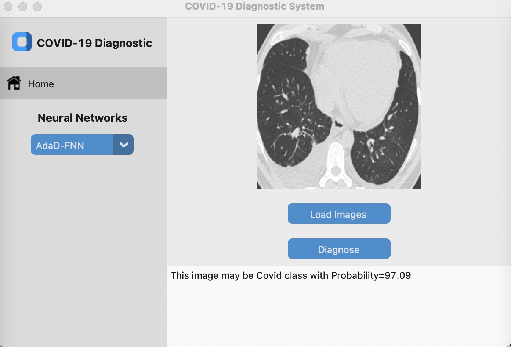

# Automatic Diagnosis of Coronavirus Disease on Chest CT Images Utilizing Deep Learning

## Introduction
<div align="center">
  
</div><br/>

Welcome to the "Automatic Diagnosis of Coronavirus Disease on Chest CT Images Utilizing Deep Learning" repository. This project focuses on the application of deep learning techniques to automatically diagnose Coronavirus Disease (COVID-19) using chest Computed Tomography (CT) images. By leveraging the power of machine learning and medical imaging, our goal is to assist healthcare professionals in the early detection and diagnosis of COVID-19 cases.

## Programming Environment

To set up the programming environment for this project, follow these steps:

### Prerequisites

- MATLAB (version 2019.A)
- Required Matlab Toolbox:
  - Image Processing Toolbox
  - Deep Learning Toolbox
  - Computer Vision Toolbox
  - Parallel Computing Toolbox
  - Optimization Toolbox
  - Fuzzy Logic Toolbox
- Python (version 3.7.10)
- Required Python packages:
  - TensorFlow
  - PyTorch
  - scikit-learn
  - NumPy
  - Pandas
  - OpenCV
  - Pillow (PIL)

### Installation

1. **MATLAB Setup**:
   - Download and install MATLAB version 2019.A from the official MathWorks website.
   - Ensure that you have the required MATLAB toolboxes.

2. **Python Setup**:
   - Install Python version 3.7.10 on your system from the official Python website.
   - Use a virtual environment to manage your project-specific dependencies. You can create one using `virtualenv` or `conda`.
   - Install the necessary Python packages using pip:
     ```shell
     pip install tensorflow torch scikit-learn numpy pandas opencv-python pillow
     ```

## Usage
In this repository, you will find three distinct deep learning models tailored for the automatic diagnosis of Coronavirus Disease (COVID-19) based on chest CT images. Each model offers a unique approach to this critical task, empowering healthcare professionals and researchers with powerful diagnostic tools.

1. **GBBNet**:
   - COVIDEXTRACT_Fea_v5.m: This MATLAB file is used for feature extraction. To run it, provide the input image folder and output feature folder as arguments.
   - COVID_Main.m: COVID_Main.m: This MATLAB file defines the neural network structure and main functions. To use it, specify the training and testing data paths, the number of epochs, and the learning rate.
   - Gradcam.m: This MATLAB file is for generating Grad-CAM maps. To run it, load your pre-trained model, provide the image path, and specify the class index.
     
2. **AdaD-FNN**:
   - COVIDEXTRACT_Fea_v5.m: This MATLAB file is used for feature extraction. To run it, provide the input image folder and output feature folder as arguments.
   - COVID_Main.m: COVID_Main.m: This MATLAB file defines the neural network structure and main functions. To use it, specify the training and testing data paths, the number of epochs, and the learning rate.
   - Gradcam.m: This MATLAB file is for generating Grad-CAM maps. To run it, load your pre-trained model, provide the image path, and specify the class index.
   - 
2. **FuzzyPID**:
   - COVIDEXTRACT_Fea_v5.m: This MATLAB file is used for feature extraction. To run it, provide the input image folder and output feature folder as arguments.
   - COVID_Main.m: COVID_Main.m: This MATLAB file defines the neural network structure and main functions. To use it, specify the training and testing data paths, the number of epochs, and the learning rate.
   - Gradcam.m: This MATLAB file is for generating Grad-CAM maps. To run it, load your pre-trained model, provide the image path, and specify the class index.


